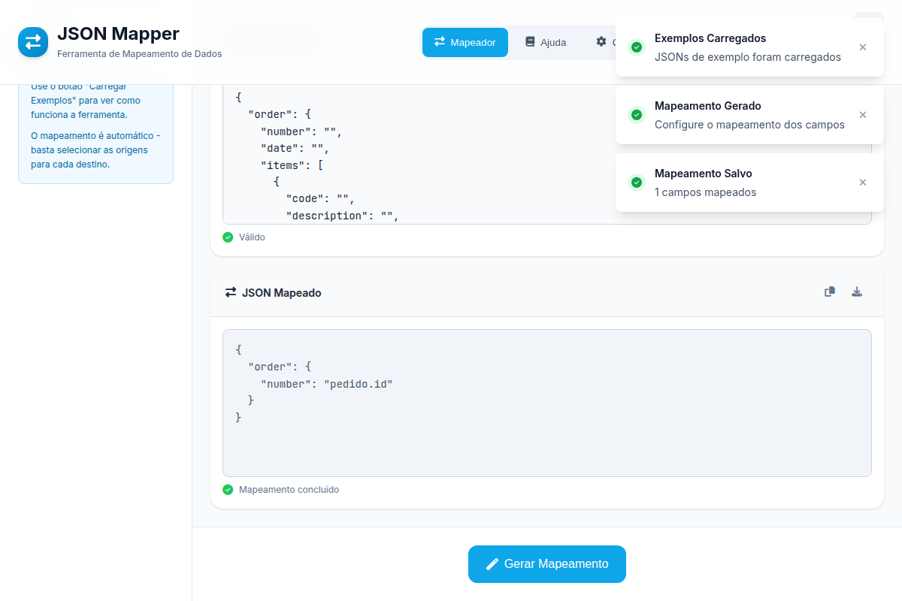
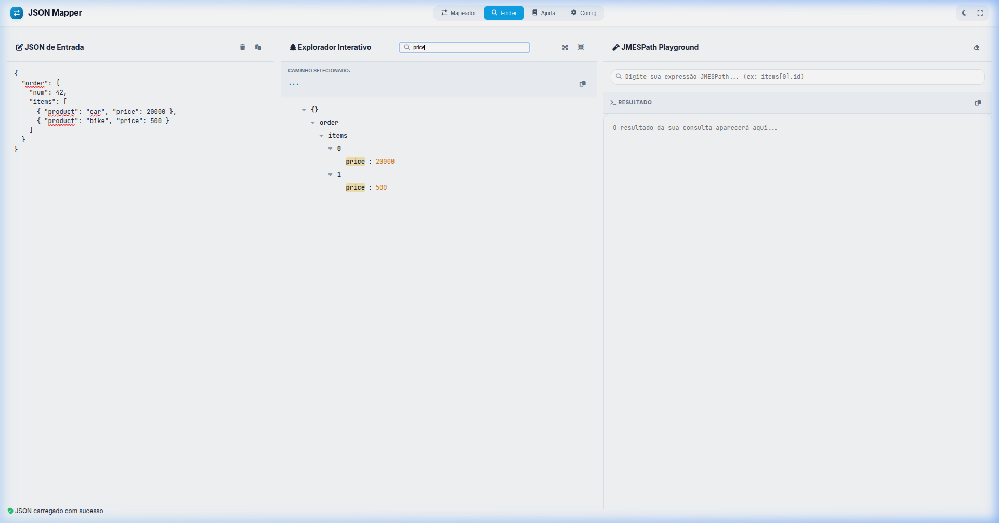

# JSON Mapper - Ferramenta Moderna de Mapeamento de Dados

<div align="center">


*Uma ferramenta poderosa e intuitiva para transformar e mapear dados JSON com JMESPath*

**Desenvolvido por [ScParis](https://github.com/ScParis)**

</div>

## 🌟 Visão Geral

O **JSON Mapper** é uma aplicação web moderna desenvolvida para simplificar o processo de transformação e mapeamento de dados JSON. Utilizando a poderosa linguagem de consulta **JMESPath**, a ferramenta permite que usuários extraiam, filtrem e transformem dados complexos de forma intuitiva e visual.

## 📸 Screenshots

### 🖥️ Interface Principal
Interface limpa e organizada com três painéis: Origem, Destino e Mapeado.


### 🚀 Mapeamento em Ação
Veja como é simples carregar exemplos e executar a transformação de dados.



### 🔍 Explorador Interativo (Finder)
Localize caminhos complexos instantaneamente clicando na árvore de nós.



### 🎓 Tutorial JMESPath Interativo
Aprenda JMESPath do básico ao avançado com exemplos práticos e executáveis.


## 🌐 Teste Agora!

[**👉 Clique aqui para testar online**](https://json-formater.netlify.app/)

*(Ou utilize o servidor local conforme instruções de instalação abaixo)*

### 🎯 Para Quem é Esta Ferramenta?

- **Desenvolvedores** que precisam transformar APIs responses
- **Analistas de Dados** que trabalham com JSON complexos
- **Engenheiros de Integração** que mapeiam dados entre sistemas
- **Equipes de ETL** que processam estruturas JSON variadas

---

## ✨ Funcionalidades Principais

### 🏗️ **Interface Moderna e Responsiva**
- **Design System 2026**: Interface inspirada nas melhores práticas modernas
- **Tema Claro/Escuro**: Alternância instantânea com persistência
- **Totalmente Responsiva**: Funciona perfeitamente em desktop, tablet e mobile
- **Acessibilidade**: Navegação por teclado e suporte a leitores de tela

### 📝 **Editores de JSON Avançados**
- **3 Editores Simultâneos**: Origem, Destino e Mapeado
- **Validação em Tempo Real**: Feedback instantâneo de sintaxe
- **Formatação Automática**: JSON indentado e colorido
- **Import/Export**: Upload de arquivos e cópia para área de transferência

### 🔍 **JSON Finder (Inspirado no JSONPathFinder)**
- **Exploração Visual**: Navegue em estruturas JSON complexas com uma árvore interativa
- **Cálculo de Paths**: Gere caminhos absolutos clicando em qualquer nó (ex: `items[0].id`)
- **Cópia Rápida**: Botão dedicado para copiar o path para uso no mapeador ou APIs
- **Feedback Visual**: Destaque de seleção e ícones contextuais para tipos de dados

### 🎯 **Mapeamento Inteligente**
- **Geração Automática**: Cria formulários baseados na estrutura do JSON de destino
- **Hierarquia Visual**: Preserva estrutura aninhada do JSON
- **Mapeamento Visual**: Seleção intuitiva de campos
- **JMESPath Integration**: Usa expressões poderosas para transformações

### 🎓 **Sistema Educacional JMESPath**
- **Tutorial Completo**: 5 módulos progressivos do básico ao avançado
- **Exemplos Interativos**: 10+ exemplos executáveis em tempo real
- **Progress Tracking**: Acompanhamento do aprendizado com persistência
- **Código Copiável**: Botões para copiar expressões e exemplos
- **Referência Completa**: Documentação detalhada de todas as operações
- **Debug Detalhado**: Logs e feedback para troubleshooting

### 🚀 **Recursos de Produtividade**
- **Atalhos de Teclado**: Ctrl+S (salvar), Ctrl+N (novo), Ctrl+O (abrir)
- **Notificações Toast**: Feedback elegante e não intrusivo
- **Loading States**: Indicadores visuais de processamento
- **Tela Cheia**: Modo imersivo de trabalho

---

## 🛠️ Tecnologias Utilizadas

### **Frontend**
- **HTML5 Semântico**: Estrutura acessível e moderna
- **CSS3 Moderno**: Design system com variáveis e animações
- **JavaScript ES6+**: Classes modernas e boas práticas
- **Font Awesome**: Ícones profissionais
- **Google Fonts**: Tipografia otimizada (Inter + JetBrains Mono)

### **Bibliotecas**
- **JMESPath 0.16.0**: Linguagem de consulta JSON poderosa
- **File System Access API**: Manipulação moderna de arquivos
- **LocalStorage**: Persistência de configurações

### **Design System**
- **Cores Systemáticas**: Paleta baseada em design tokens
- **Espaçamento Consistente**: Sistema de espaçamento em rem
- **Sombras e Profundidade**: Sistema de sombras em múltiplos níveis
- **Animações Suaves**: Transições elegantes e performáticas

---

## 🚀 Como Usar

### **Passo 1: Carregar Dados**
```bash
# Opções disponíveis:
1. Cole o JSON diretamente nos editores
2. Use o botão "Carregar Exemplos" para dados de teste
3. Importe arquivos JSON via upload
4. Use os atalhos Ctrl+O para abrir arquivos
```

### **Passo 2: Gerar Mapeamento**
```bash
# Clique em "Gerar Mapeamento" para:
- Analisar a estrutura do JSON de destino
- Criar formulário hierárquico automático
- Exibir opções de mapeamento para cada campo
```

### **Passo 3: Configurar Mapeamento**
```bash
# No formulário de mapeamento:
- Selecione os campos de origem para cada destino
- Use expressões JMESPath para transformações
- Visualize a estrutura hierárquica
```

### **Passo 4: Executar Transformação**
```bash
# Clique em "Executar Mapeamento" para:
- Aplicar as regras de mapeamento
- Gerar o JSON transformado
- Exibir resultado no editor de mapeado
```

### **Extra: Localizando Caminhos com o Finder**
```bash
# Se você não sabe o caminho exato para um campo:
1. Clique na aba "Finder" no header
2. Cole seu JSON de origem no painel esquerdo
3. Explore a árvore interativa no painel direito
4. Clique no valor desejado para ver o caminho absoluto
5. Clique em "Copiar Caminho" para usar no configurador de mapeamento
```

---

## 🎓 Tutorial JMESPath Interativo

### **Módulos do Tutorial**

O JSON Mapper inclui um tutorial completo de JMESPath com 5 módulos progressivos:

#### **📚 Módulo 1: Básico**
- Fundamentos do JMESPath
- Sintaxe básica e operadores
- Acesso a propriedades e arrays
- Dicas importantes para iniciantes

#### **🔍 Módulo 2: Filtros**
- Operadores de comparação (==, >, <, !=)
- Operadores lógicos (&&, ||, !)
- Filtros complexos e aninhados
- Boas práticas de filtragem

#### **📊 Módulo 3: Projeções**
- Lista projeção (seleção de campos)
- Hash projeção (criação de objetos)
- Transformações avançadas
- Pipe operator

#### **🧮 Módulo 4: Funções**
- Funções de agregação (sum, length, max, min)
- Funções de string (upper_case, split, join)
- Funções de array (sort_by, reverse)
- Composição de funções

#### **🚀 Módulo 5: Avançado**
- Pipe operator encadeado
- Expressões condicionais ternárias
- Consultas aninhadas complexas
- Técnicas profissionais

### **Recursos Educacionais**

- **10+ Exemplos Interativos**: Execute expressões JMESPath em tempo real
- **Progress Tracking**: Acompanhe seu aprendizado com persistência local
- **Código Copiável**: Copie exemplos para uso em seus projetos
- **Explicações Detalhadas**: Cada conceito com explicação clara
- **Layout Responsivo**: Aprenda em qualquer dispositivo

### **Como Acessar o Tutorial**

1. Abra o JSON Mapper
2. Clique no botão **"Tutorial"** no header
3. Navegue pelos módulos progressivamente
4. Execute os exemplos interativos
5. Pratique com seus próprios dados

---

## 📚 Exemplos Práticos

### **Exemplo 1: Transformação de E-commerce**

**JSON de Origem (API do Produto):**
```json
{
  "products": [
    {
      "id": "PROD-001",
      "name": "Smartphone Galaxy S21",
      "price": 3299.99,
      "category": {
        "id": "CAT-001",
        "name": "Electronics",
        "department": "Technology"
      },
      "inventory": {
        "stock": 45,
        "reserved": 5,
        "available": 40
      },
      "specs": {
        "screen": "6.2 inches",
        "storage": "128GB",
        "ram": "8GB"
      }
    }
  ],
  "metadata": {
    "total": 1,
    "timestamp": "2024-01-15T10:30:00Z"
  }
}
```

**JSON de Destino (Formato ERP):**
```json
{
  "items": [
    {
      "product_code": "",
      "description": "",
      "unit_price": 0,
      "category_name": "",
      "department": "",
      "stock_quantity": 0,
      "available_stock": 0
    }
  ]
}
```

**Mapeamento com JMESPath:**
```javascript
{
  "items": products[*].{
    "product_code": id,
    "description": name,
    "unit_price": price,
    "category_name": category.name,
    "department": category.department,
    "stock_quantity": inventory.stock,
    "available_stock": inventory.available
  }
}
```

**Resultado:**
```json
{
  "items": [
    {
      "product_code": "PROD-001",
      "description": "Smartphone Galaxy S21",
      "unit_price": 3299.99,
      "category_name": "Electronics",
      "department": "Technology",
      "stock_quantity": 45,
      "available_stock": 40
    }
  ]
}
```

### **Exemplo 2: Integração de Sistemas**

**JSON de Origem (CRM):**
```json
{
  "contacts": [
    {
      "contact_id": "C12345",
      "personal_info": {
        "first_name": "João",
        "last_name": "Silva",
        "email": "joao.silva@company.com",
        "phone": "+55 11 98765-4321"
      },
      "address": {
        "street": "Rua das Flores, 123",
        "city": "São Paulo",
        "state": "SP",
        "postal_code": "01234-567",
        "country": "Brazil"
      },
      "company_info": {
        "company": "Tech Solutions Ltda",
        "position": "Senior Developer",
        "department": "Engineering"
      },
      "status": "active",
      "created_date": "2024-01-10T09:00:00Z"
    }
  ]
}
```

**JSON de Destino (ERP):**
```json
{
  "employees": [
    {
      "employee_code": "",
      "full_name": "",
      "email_address": "",
      "phone_number": "",
      "job_title": "",
      "department": "",
      "work_location": "",
      "is_active": false,
      "hire_date": ""
    }
  ]
}
```

**Mapeamento com JMESPath:**
```javascript
{
  "employees": contacts[?status=='active'].{
    "employee_code": contact_id,
    "full_name": personal_info.first_name + ' ' + personal_info.last_name,
    "email_address": personal_info.email,
    "phone_number": personal_info.phone,
    "job_title": company_info.position,
    "department": company_info.department,
    "work_location": address.city + ', ' + address.state,
    "is_active": status == 'active',
    "hire_date": created_date
  }
}
```

---

## 🎓 Expressões JMESPath Úteis

### **Filtros Básicos**
```javascript
// Filtrar usuários ativos
users[?active==true]

// Filtrar produtos com preço > 1000
products[?price>1000]

// Filtrar por categoria específica
items[?category=='electronics']
```

### **Projeções e Transformações**
```javascript
// Selecionar campos específicos
users[*].[name, email]

// Criar novos objetos
users[*].{fullName: firstName + ' ' + lastName, age: age}

// Extrair valores de arrays
orders[*].items[*].price
```

### **Funções Avançadas**
```javascript
// Contar elementos
length(users[?active==true])

// Somar valores
sum(products[*].price)

// Converter para maiúsculas
upper_case(users[*].name)

// Juntar arrays
[users, admins] | sort_by(@, &name)
```

---

## 🎨 Interface do Usuário

### **Layout Principal**
```
┌─────────────────────────────────────────────────────────────┐
│                    Header Moderno                        │
│  [Logo] [Navegação] [Tema] [Ajuda] [Tela Cheia]    │
├─────────────┬───────────────────────────────────────────┤
│   Sidebar   │           Área Principal                  │
│             │                                         │
│ [Ações]    │  ┌─────────┬─────────┬───────────────┐   │
│ [Exemplos] │  │ Origem  │ Destino │ Mapeado     │   │
│ [Limpar]   │  │ JSON    │ JSON    │ JSON         │   │
│             │  └─────────┴─────────┴───────────────┘   │
│ [Dicas]     │                                         │
│ [Info]      │           [Toolbar]                       │
│             │                                         │
│             │         [Botões de Ação]                 │
└─────────────┴───────────────────────────────────────────┘
```

### **Modal de Mapeamento**
```
┌─────────────────────────────────────────┐
│  Configurar Mapeamento              │
├─────────────────────────────────────────┤
│  📁 items[0].product_code          │
│  └─► [Selecione campo de origem]   │
│                                    │
│  📁 items[0].description          │
│  └─► [Selecione campo de origem]   │
│                                    │
│  📁 items[0].unit_price           │
│  └─► [Selecione campo de origem]   │
│                                    │
├─────────────────────────────────────────┤
│        [Cancelar] [Salvar]           │
└─────────────────────────────────────────┘
```

---

## 🚀 Começando Rápido

### **Instalação Local**
```bash
# Clone o repositório
git clone https://github.com/ScParis/JSON-Mapping-Tool.git

# Navegue para o diretório
cd JSON-Mapping-Tool

# Inicie o servidor local
python3 -m http.server 8080

# Abra no navegador
open http://localhost:8080
```

### **Usando Exemplos**
1. Abra a aplicação no navegador
2. Clique em **"Carregar Exemplos"** na sidebar
3. Clique em **"Gerar Mapeamento"** 
4. Configure o mapeamento desejado
5. Clique em **"Executar Mapeamento"**

### **Aprendendo JMESPath**
1. Clique no botão **"Ajuda"** no header
2. Explore o **Tutorial** com exemplos interativos
3. Teste expressões no **Playground**
4. Consulte a **Referência** rápida

---

## 🔧 Configuração e Personalização

### **Variáveis CSS (Design System)**
```css
:root {
  /* Cores Primárias */
  --primary-50: #eff6ff;
  --primary-500: #3b82f6;
  --primary-600: #2563eb;
  
  /* Tipografia */
  --font-sans: 'Inter', sans-serif;
  --font-mono: 'JetBrains Mono', monospace;
  
  /* Espaçamento */
  --space-1: 0.25rem;
  --space-4: 1rem;
  --space-8: 2rem;
}
```

### **Atalhos de Teclado**
| Atalho | Ação |
|---------|-------|
| `Ctrl + N` | Novo mapeamento |
| `Ctrl + O` | Abrir arquivo |
| `Ctrl + S` | Salvar mapeamento |
| `Ctrl + V` | Colar JSON |
| `Escape` | Fechar modal |
| `F11` | Tela cheia |

---

## ❓ FAQ

**P: Posso usar expressões complexas no JMESPath?**
R: Sim! A ferramenta suporta o padrão completo do JMESPath. Você pode usar filtros, projeções e funções integradas. Consulte a seção de "Expressões JMESPath Úteis" para exemplos.

**P: Meus dados serão salvos?**
R: Sim, seus mapeamentos e configurações são salvos automaticamente no `localStorage` do seu navegador. Você também pode exportar todo o histórico para um arquivo de backup nas configurações.

**P: A ferramenta processa os dados no servidor?**
R: Não. Todo o processamento é feito localmente no seu navegador, garantindo privacidade e segurança para seus dados.

---

## 🩺 Troubleshooting

### Problema: "JSON inválido na posição X"
- **Causa**: O JSON inserido possui erro de sintaxe (vírgula sobrando, aspas faltando, etc).
- **Solução**: Use o botão **"Format JSON"** na toolbar para identificar onde a estrutura quebra.

### Problema: "Mapeamento executado resultando em {}"
- **Causa**: Você executou o mapeamento sem configurar as chaves no modal ou as expressões JMESPath não retornaram resultados.
- **Solução**: Clique em **"Gerar Mapeamento"** primeiro, selecione as origens para cada campo de destino e salve antes de executar.

### Problema: "Não consigo abrir arquivos"
- **Causa**: Alguns navegadores antigos podem não suportar a File System Access API.
- **Solução**: Certifique-se de estar usando uma versão recente do Chrome, Edge ou Firefox.

---

## 📋 Pré-requisitos

- Navegador moderno (Chrome 86+, Edge 86+, Firefox 85+, Safari 14.1+)
- JavaScript habilitado
- Resolução de tela recomendada: 1280x720 ou superior

---

## 📝 Changelog

### v2.2 (Atual - Fev 2026)
- 🎓 **Tutorial JMESPath Completo**: 5 módulos progressivos do básico ao avançado
- 🎯 **10+ Exemplos Interativos**: Execute expressões JMESPath em tempo real
- 📊 **Progress Tracking**: Acompanhamento do aprendizado com persistência
- 🎨 **Layout Otimizado**: Interface ocupa 100% da largura do navegador
- 🌓 **Tema Unificado**: Controle de tema simplificado via botão único
- 📱 **Responsividade Aprimorada**: Design adaptativo para todos os dispositivos
- 🔗 **Links GitHub**: Acesso direto ao repositório no rodapé
- 🗑️ **Interface Limpa**: Remoção de botões/configurações redundantes

### v2.1
- 🔍 **Novo Módulo Finder**: Explorador interativo de JSON para facilitar a localização de caminhos.
- 🔢 **Caminhos Indexados**: Suporte nativo a índices em arrays (ex: `itens[0]`) no mapeador.
- 🚫 **Valores Unquoted**: Opção para exportar valores sem aspas no JSON mapeado (compatibilidade JMESPath).
- 🏗️ **Refinamento de Layout**: Header mais compacto e navegação via modais para Ajuda e Configs.

### v2.0
- ✨ Interface totalmente redesenhada com Design System 2026.
- 🌓 Tema Dark/Light com persistência.
- 📂 Suporte a File System Access API para manipulação de arquivos.
- 🚀 Melhoria de performance no motor de mapeamento dinâmico.

### v1.0
- 🎉 Lançamento inicial da ferramenta com suporte básico a JMESPath.

---

## 🤝 Contribuição

### **Como Contribuir**
1. **Fork** o repositório
2. **Crie** uma branch para sua feature (`git checkout -b feature/AmazingFeature`)
3. **Commit** suas mudanças (`git commit -m 'Add some AmazingFeature'`)
4. **Push** para a branch (`git push origin feature/AmazingFeature`)
5. **Abra** um Pull Request

### **Áreas para Contribuição**
- 🎨 **Melhorias de UI/UX**
- 🔧 **Novas funcionalidades**
- 📚 **Documentação**
- 🐛 **Bug fixes**
- ⚡ **Performance**

---

## 📄 Licença

Este projeto está licenciado sob a Licença MIT.

---

## 🙏 Agradecimentos

- **JMESPath Team** - Pela linguagem de consulta poderosa
- **Font Awesome** - Pelos ícones incríveis
- **Google Fonts** - Pela tipografia de qualidade
- **Comunidade Open Source** - Pela inspiração e suporte

---

## 📞 Contato e Suporte

- **Issues**: [GitHub Issues](https://github.com/ScParis/JSON-Mapping-Tool/issues)
- **Discussions**: [GitHub Discussions](https://github.com/ScParis/JSON-Mapping-Tool/discussions)
- **Email**: [schparis@gmail.com](mailto:schparis@gmail.com)

---

<div align="center">

**⭐ Se este projeto ajudou você, dê uma estrela!**

Made with ❤️ by [ScParis](https://github.com/ScParis)

</div>
